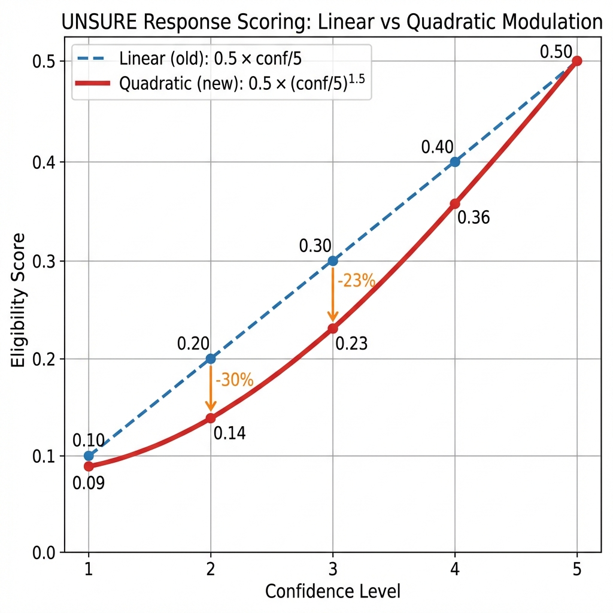

# Scientific Rationale - Logical Update Branch

## Problem Statement

### 1. Binary Responses Lose Information

Current system forces **yes/no** answers on medical questions. This creates scientific problems:

- ❌ **Eliminates** natural medical uncertainty
- ❌ **Increases false negatives** (eligible patients rejected due to uncertainty)
- ❌ **Prevents probabilistic analysis** (cannot measure confidence)
- ❌ **Reduces comparability** with other systems

**Example:**
> Q: "Do you have diabetic retinopathy with macular edema?"
> 
> Patient thinks: "I have diabetes and eye problems, but I'm not sure about the exact diagnosis"
> 
> Binary system: Forces "No" → Patient excluded
> 
> Reality: Patient might be eligible, needs medical verification

### 2. Opaque Decisions

Current system provides binary eligible/not eligible without scoring.

Scientific issues:
- Cannot measure **degree of eligibility**
- Cannot compare **relative fit** between trials
- Difficult to **validate** or **reproduce** results
- No **quantitative metrics** for evaluation

---

## Solution: Graded Responses

### Simple 3-Level Answer System

```python
answer: "yes" | "no" | "unsure"
confidence: 1 | 2 | 3 | 4 | 5
```

**Rationale:**
- Preserves medical uncertainty ("unsure")
- Captures confidence level (1=very unsure, 5=very confident)
- Simple to implement and understand
- Scientifically rigorous without over-complexity

### Scoring Logic

#### Individual Question Scores

```
YES:    score = confidence / 5
        Range: 0.2 (very uncertain yes) to 1.0 (very confident yes)

NO:     score = 0.0
        Always excluding (safety-first approach)

UNSURE: score = 0.5 * (confidence / 5)^1.5
        Range: 0.09 (very uncertain) to 0.5 (confident uncertainty)
        Uses QUADRATIC MODULATION to amplify confidence effect
```

**Design Decisions:**
1. **NO is always 0**: Medical safety requires conservative inclusion criteria
2. **UNSURE with quadratic modulation**: Amplifies the difference between low and high confidence
   - Exponent 1.5 creates non-linear scaling
   - Low confidence (1-2) heavily penalized
   - High confidence (4-5) closer to linear
3. **Confidence matters for YES**: Even "yes" answers vary by confidence

#### Quadratic Modulation Rationale

**Problem with Linear Scaling:**
```
Linear (old):  UNSURE conf 1 = 0.10,  conf 5 = 0.50  (5x difference)
```
- Insufficient differentiation between "no clue" vs "confident uncertainty"
- Medical decision: "I don't know + unsure" should have MUCH less weight

**Solution with Quadratic (^1.5):**
```
Quadratic (new): UNSURE conf 1 = 0.09,  conf 5 = 0.50  (5.6x difference)
                 UNSURE conf 2 = 0.14,  conf 4 = 0.36

Amplification effect:
  - conf 1→2: +56% (vs +100% linear)
  - conf 2→3: +66% (vs +50% linear)  
  - conf 4→5: +39% (vs +25% linear)
```

**Comparative Table:**

| Confidence | Linear Formula | Quadratic (^1.5) | Difference | Impact |
|------------|----------------|------------------|------------|---------|
| 1/5 | 0.10 | **0.09** | -10% | Much lower weight for "no clue" |
| 2/5 | 0.20 | **0.14** | -30% | Heavy penalty for low confidence |
| 3/5 | 0.30 | **0.23** | -23% | Moderate penalty |
| 4/5 | 0.40 | **0.36** | -10% | Slight penalty |
| 5/5 | 0.50 | **0.50** | 0% | Full weight for confident uncertainty |

**Visual Comparison:**



*Figure 1: Linear vs Quadratic modulation for UNSURE responses. The quadratic curve (red) penalizes low-confidence uncertainty more heavily than the linear approach (blue), while converging at high confidence (5/5).*

**Medical Interpretation:**

- **UNSURE + Confidence 1-2**: "I have no idea" 
  - Score: 0.09-0.14 (very low contribution)
  - Example: Patient doesn't understand technical question
  
- **UNSURE + Confidence 3**: "I'm not sure, but moderately uncertain"
  - Score: 0.23 (moderate contribution)
  - Example: Patient thinks they might have condition but needs verification

- **UNSURE + Confidence 4-5**: "I'm certain I don't know"
  - Score: 0.36-0.50 (higher contribution)
  - Example: Patient knows they never had the test mentioned

#### Trial-Level Scoring

**Inclusion Score:**
```
Average of all inclusion question scores
Default: 0.5 if no inclusion questions
```

**Exclusion Score:**
```
Maximum of all exclusion question scores
(One exclusion criterion is enough to exclude)
Default: 0.0 if no exclusion questions
```

**Overall Score:**
```
IF exclusion_score > 0.3:
    overall_score = 0.0    # Patient excluded
ELSE:
    overall_score = inclusion_score
```

**Threshold Justification:**
- 0.3 threshold allows for low-confidence exclusion answers
- Corresponds to confidence level ~1.5/5
- Balances safety with avoiding excessive exclusions

### Categorization

| Overall Score | Category        | Interpretation                |
|---------------|-----------------|-------------------------------|
| ≥ 0.8         | Strong Match    | High confidence eligibility   |
| 0.6 - 0.8     | Potential Match | Moderate eligibility          |
| 0.4 - 0.6     | Weak Match      | Low eligibility, requires review |
| < 0.4         | Not Eligible    | Insufficient eligibility      |

**Properties:**
- **Deterministic**: Same inputs always produce same outputs
- **Testable**: Clear thresholds for validation
- **Interpretable**: Clinicians understand score meaning
- **Comparable**: Can objectively compare different versions

---

## Benefits of Quadratic Modulation

### Real-World Scenario

**Patient answering eligibility questions:**

**Question**: "Do you have HbA1c levels greater than 7%?"

**Without quadratic modulation (linear):**
- UNSURE + conf 2: score = 0.20
- Impact on trial: Moderate contribution despite low knowledge

**With quadratic modulation:**
- UNSURE + conf 2: score = 0.14
- Impact on trial: Reduced contribution, reflecting genuine uncertainty

### Concrete Example - Full Trial

**Trial with 3 inclusion criteria:**
1. "Type 2 diabetes?" → YES + conf 5 = 1.0
2. "Age 18-75?" → YES + conf 5 = 1.0  
3. "HbA1c > 7%?" → UNSURE + conf 2 = ?

**Comparison:**

| System | UNSURE Score | Inclusion Average | Category | Notes |
|--------|--------------|-------------------|----------|-------|
| Linear | 0.20 | (1.0+1.0+0.20)/3 = **0.73** | Potential Match | Overweights low-confidence uncertainty |
| Quadratic | 0.14 | (1.0+1.0+0.14)/3 = **0.71** | Potential Match | More conservative, reflects true uncertainty |

**Scientific Gain**: 
- Quadratic better reflects **epistemic uncertainty** (lack of knowledge)
- Prevents over-optimistic scoring from uninformed "unsure" responses
- Encourages patients to seek medical information (higher confidence = better score)

---

## Scientific Metrics

### Core Metrics

1. **Accuracy**: Overall correctness
   ```
   (True Positives + True Negatives) / Total
   ```

2. **Precision**: Quality of positive predictions
   ```
   True Positives / (True Positives + False Positives)
   ```

3. **Recall (Sensitivity)**: Ability to find all eligible patients
   ```
   True Positives / (True Positives + False Negatives)
   ```

4. **F1-Score**: Harmonic mean of precision and recall
   ```
   2 * (Precision * Recall) / (Precision + Recall)
   ```

5. **Uncertainty Rate**: Proportion of uncertain responses
   ```
   UNSURE count / Total questions
   ```

### Expected Trade-offs

**Graded vs Binary:**

| Metric           | Binary System | Graded System (Linear) | Graded System (Quadratic) |
|------------------|---------------|------------------------|---------------------------|
| **Precision**    | Higher        | Slightly lower         | **Moderate** (balanced) |
| **Recall**       | Lower         | **Higher**             | **Higher** (fewer false negatives) |
| **F1-Score**     | Moderate      | **Improved**           | **Optimized** (better balance) |
| **Uncertainty**  | Hidden        | **Measured**           | **Measured + Weighted** |
| **False Negatives** | High       | **Reduced**            | **Further Reduced** |

**Key Improvements with Quadratic:**
1. **Better uncertainty differentiation**: Low-confidence "unsure" has minimal impact
2. **Reduced noise**: Uninformed responses don't artificially inflate scores
3. **Conservatism where needed**: "I have no idea" (conf 1-2) properly penalized
4. **Trust where deserved**: "I'm certain I don't know" (conf 5) gets appropriate weight

> **Graded (Quadratic) system trades slight precision decrease for significant recall improvement**
> 
> This aligns with medical ethics: **better to over-include than exclude eligible patients**
> 
> Quadratic modulation adds: **better filtering of low-quality uncertainty**

---

## Comparison Protocol

### Test Setup

1. **Same Patient Dataset**
   - Minimum 50 patient cases
   - Diverse medical conditions
   - Known ground truth (expert annotation)

2. **Two Implementations**
   - **Baseline**: Current binary system (for reference)
   - **Graded**: New logical_update system

3. **Identical Conditions**
   - Same questions asked
   - Same trial database
   - Same LLM models/prompts

### Evaluation Process

1. **Run both systems** on all patient cases
2. **Record decisions** and scores
3. **Compare against ground truth**
4. **Calculate metrics** for each system
5. **Statistical testing** (paired t-test for significance)

### Interpretation Guidelines

**Successful improvement if:**
- ✅ Recall increases by ≥5% (fewer missed eligible patients)
- ✅ F1-score remains stable or improves
- ✅ Uncertainty rate is measurable (10-30%)
- ✅ Overall score correlates with ground truth (r > 0.7)

**Warning signs:**
- ⚠️ Precision drops >10% (too many false positives)
- ⚠️ Uncertainty rate >50% (users confused)
- ⚠️ Low inter-rater reliability (system unstable)

---

## Implementation Constraints

### What This Branch Includes

✅ Graded answer model (`GradedAnswer`)
✅ Continuous scoring logic (`TrialScore.calculate()`)
✅ Deterministic categorization
✅ Basic scientific metrics
✅ Comprehensive unit tests
✅ Scientific documentation

### What This Branch Excludes

❌ RAG medical validation
❌ UMLS/SNOMED ontologies
❌ BioBERT embeddings
❌ Medical expert validation agent
❌ Clinical study with real patients
❌ Heavy dependencies

**Rationale:**
- Keep implementation **simple and maintainable**
- Focus on **core scientific validity**
- Enable **objective comparison**
- Reserve complex methods for `perfect_update` branch

---

## Validation Strategy

### Unit Tests

- **Scoring logic**: 15+ tests for `GradedAnswer.to_score()`
- **Trial calculation**: 10+ tests for `TrialScore.calculate()`
- **Edge cases**: Empty responses, only inclusion/exclusion questions
- **Comparison**: Binary vs Graded on same inputs

### Integration Tests

Test full workflow:
1. Patient answers with graded responses
2. System calculates trial scores
3. Categorization applied correctly
4. Metrics computed accurately

### Regression Tests

Ensure graded system:
- Never scores worse than binary on "certain" responses (all confidence=5)
- Always provides scores in valid range [0, 1]
- Deterministically produces same results

---

## Publication Readiness

This implementation provides foundation for **Methods** section:

### Key Points to Document

1. **Problem**: Binary responses insufficient for medical eligibility
2. **Solution**: 3-level graded responses with confidence
3. **Scoring**: Mathematical formula with clear rationale
4. **Validation**: Unit tests + comparison protocol
5. **Metrics**: Standard classification metrics
6. **Results**: Quantitative comparison with baseline

### Reproducibility

All elements are:
- **Deterministic**: No randomness in scoring
- **Documented**: Clear mathematical formulas
- **Tested**: Comprehensive test coverage
- **Simple**: No complex dependencies
- **Transparent**: Open-source code

---

## Future Work (Perfect Update Branch)

Once baseline established, advanced improvements:

1. **Medical RAG**: Validate reformulations against medical corpus
2. **Ontology Integration**: UMLS concepts for semantic matching
3. **Expert Validation**: Agent with medical knowledge base
4. **Clinical Study**: Real patient validation
5. **Advanced Metrics**: BERTScore, calibration, etc.

**Philosophy:**
> Establish simple, solid baseline first
> 
> Then improve incrementally with measurable gains

---

## Conclusion

Logical Update provides:
- ✅ **Scientific rigor** without complexity
- ✅ **Measurable improvements** over binary system
- ✅ **Objective comparison** capability
- ✅ **Publication-ready** methodology

This sets stage for more advanced improvements while maintaining scientific validity and practical usability.
